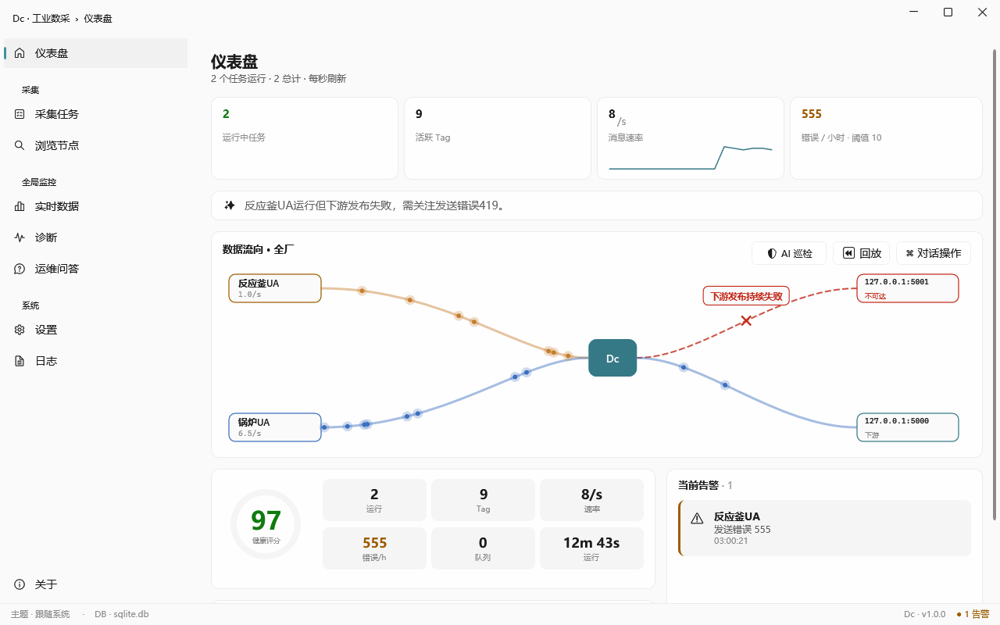
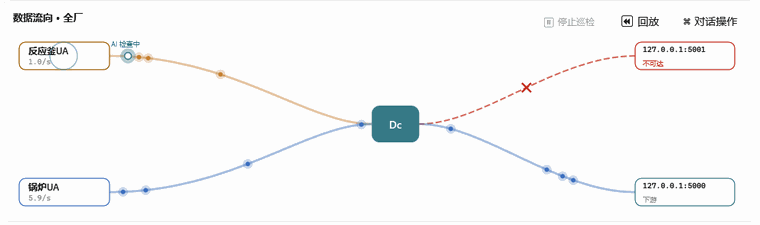
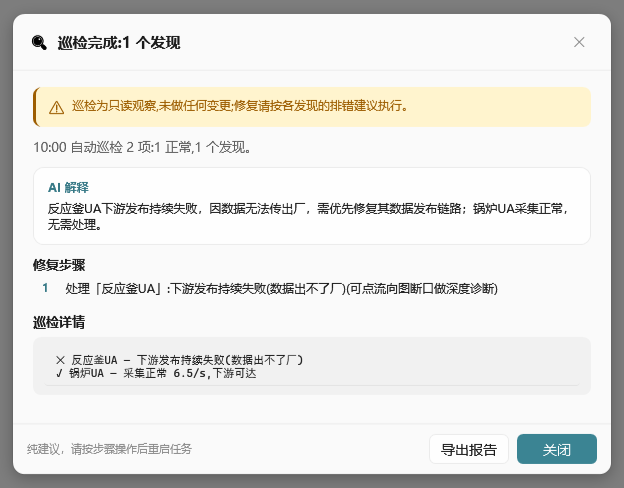
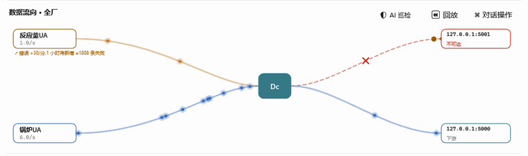
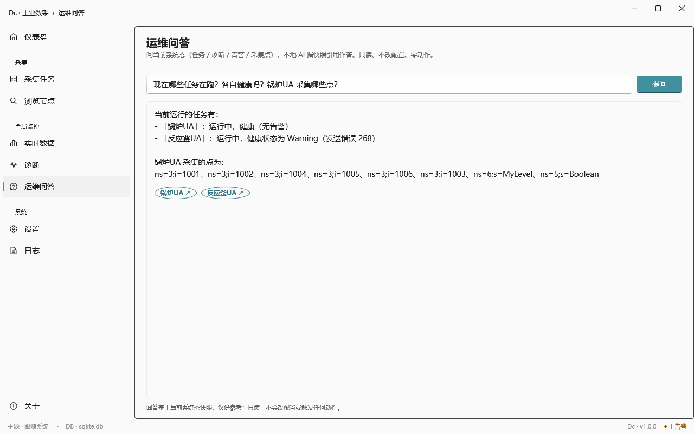
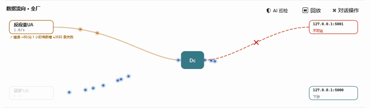
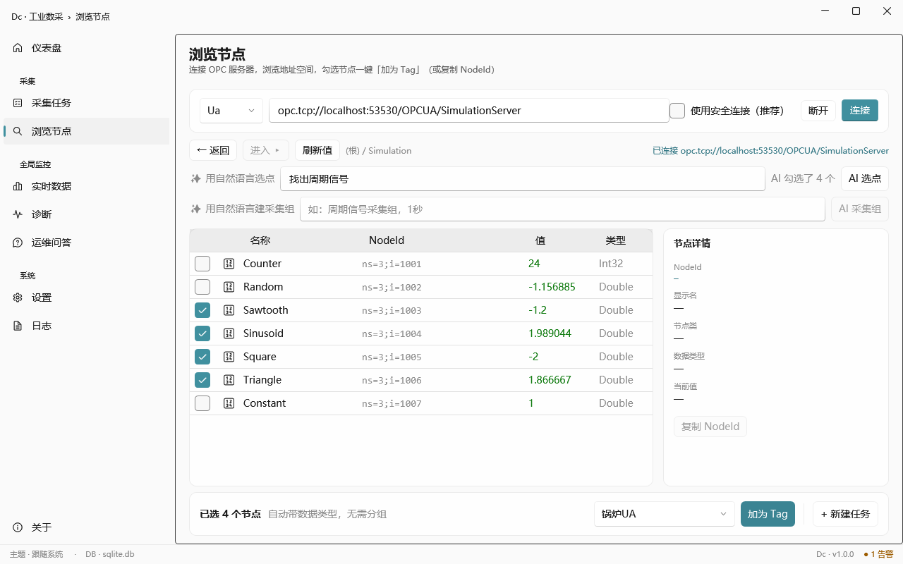
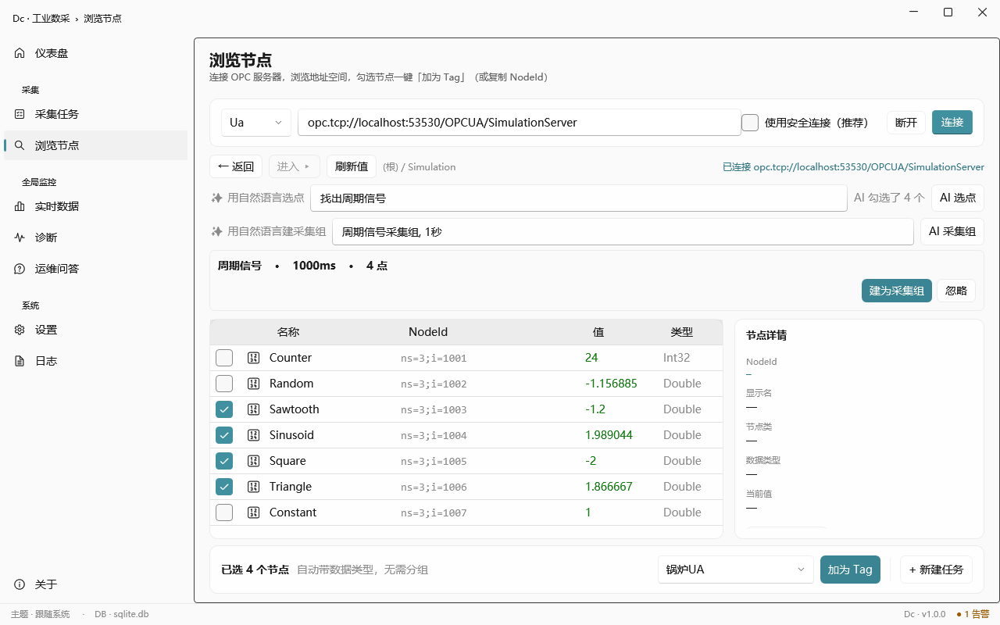
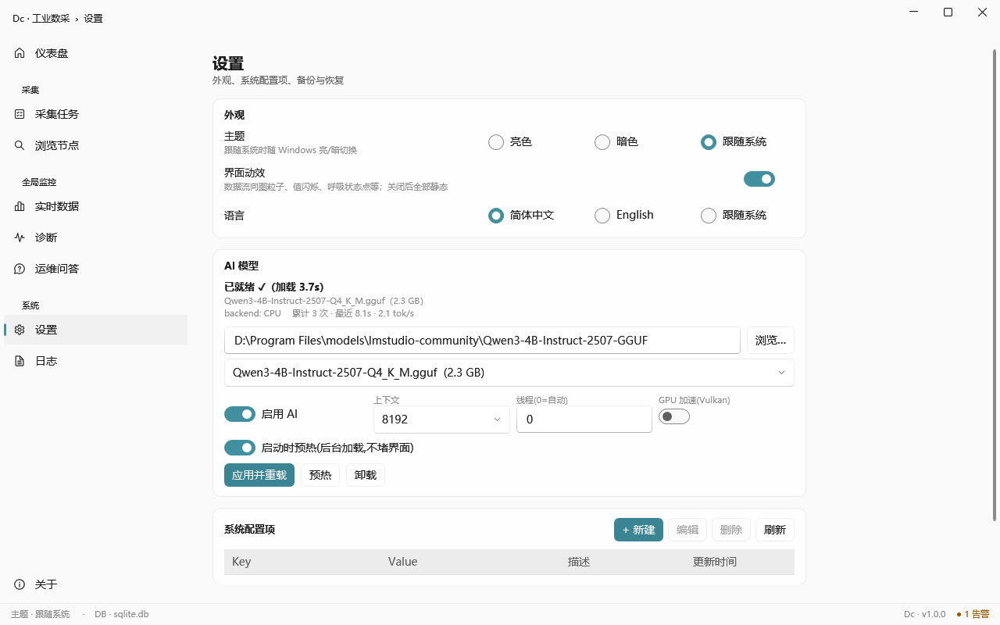

# Dc · Industrial Data Collector (Free Edition)

> **[中文](README.md)** · English
>
> Industrial data acquisition client with a **fully local AI copilot**. Free for non-commercial use, distributed as a closed-source binary.

Collect from **OPC UA / OPC DA / Modbus / Siemens S7 / IEC 60870-5-104** devices, subscribe in real time, and publish downstream over TCP.

**The AI runs entirely on your machine.** No cloud, no telemetry, no data leaving the plant.

**[⬇ Download latest (v1.2.0)](../../releases/latest)** · Windows x64 · ~106 MB · unzip and run `Dc.App.exe` — **.NET runtime bundled, no install required**

> First launch: Windows SmartScreen will warn about an "unknown publisher" — the release is not code-signed. Click *More info → Run anyway*.

---

## Why this exists

Most "industrial AI" offerings require shipping your process data to a cloud platform. For a large number of plants — defense suppliers, regulated industries, or simply sites where IT says no — **that makes every one of those products unusable.**

This one keeps both halves on the same machine: the collector, and a language model that actually helps.

---

## What it does

### See where your data is flowing

One pipe per collection task, with live data points moving along it. A downstream failure shows an immediate red break plus a deterministic extrapolation — *"errors +60/min, ≈3575 more failures within the hour"* — so you know how urgent it is.

That number is **computed, not generated by the model.** This boundary shows up throughout the design.

### AI patrol: sweeps every task, flags what's wrong

A light orb sweeps task by task, plants a flag on anything broken, and writes a plain-language report:

**Patrol observes only.** It never changes configuration or restarts tasks on its own.

### Click a break, get a root cause

A comet traces the pipe backwards to the break, then offers a diagnosis: root-cause explanation, step-by-step remediation, and runtime metrics. **Advisory only.**

### Ask in plain language, get grounded answers

Ask *"which tasks are running, are they healthy, what points does Boiler-UA collect?"* — the answer cites **real task names, real health state, real node IDs**.

More important than the feature itself: **if the answer isn't in the current snapshot, it says so** rather than inventing a plausible-sounding one. In an industrial context, a confidently wrong assistant is worse than no assistant.

Whichever task the answer cites gets highlighted in the flow map:

### Select points and build groups in natural language

Say *"find the periodic signals"* and it ticks the four waveforms:

Say *"periodic-signal group, 1 second"* and it fills in task name, interval and points:

**It only selects and names — it never invents an address.** Node IDs always come from a real browse result. Letting a model guess `ns=3;s=...` is where tools like this usually fail.

### Manage models from the UI

Pick a GGUF file, hot-swap it, toggle GPU (Vulkan) acceleration, watch inference stats (tokens/s, load time, active backend).

The backend field is **actually probed** — it hooks the native inference log and only reports Vulkan once a real device shows up. "Says GPU, secretly on CPU" is a trap worth closing.

---

## Before you download — the honest part

**Only OPC UA and DA are verified against real servers.**
Modbus, S7 and IEC104 were validated against **soft PLCs, not real hardware** (snap7, an independent CS104 server, a purpose-built Modbus server). Interop was tested seriously — the IEC104 work included a 600-second soak, 299 interrogation rounds, 2100 ASDUs, with values and quality bits correct across five information-object types — but **a soft PLC is not a real PLC.** Validate on your own devices before production.

**No model is bundled.** The 106 MB package contains no weights. Bring your own GGUF (a 4B-class Qwen model is what the screenshots use).

**You want a GPU.** Measured on identical model and prompt: **40 seconds on an RTX 4070 vs 50 minutes still unfinished on CPU** (59.75 tok/s vs 0.5 → 0.185, degrading as context grows). A consumer card is plenty — a 12 GB 4070 fits a 9B model entirely in VRAM at 5.2 GB. Without a GPU, collection is unaffected; the AI features are impractically slow.

**Other limits:** Windows desktop only · not code-signed · closed-source binary, free for non-commercial use · no auto-update · **AI is advisory throughout — it never changes configuration or restarts tasks by itself.** That last one is a deliberate design choice, not an unfinished feature.

---

## Not included in the Free Edition

Neither exclusion is a licensing issue — as of v1.2.0 every dependency is permissively licensed, with no GPL components:

- **OPC AE** — the COM client is written in-house with no GPL dependency; it has simply had a short verification history and will run in the commercial edition a while longer first.
- **EtherNet/IP** (Rockwell / AB Logix) — its dependency is Apache-2.0. It has **not been verified against real Allen-Bradley hardware**, only soft-PLC simulation. Unverified code doesn't ship here.

---

## License

- **Free for non-commercial use** — personal, evaluation, and internal organizational use
- **Commercial deployment requires prior written permission** — contact before shipping in a commercial product or paid service
- No decompilation or reverse engineering; unmodified redistribution of the complete package is permitted

Full terms in `LICENSE-FREEWARE.txt` inside the release. Contact: **adamyxt@outlook.com**

---

*Screenshots are captured from real runs (OPC UA simulation server + local 4B-class model). Software provided "as is", without warranty of any kind.*
