# Dc · 工业数据采集（免费版 Freeware）

> 通用工业数据采集客户端，内置**本地 AI 副驾**。免费下载使用，闭源二进制发行。

采集 **OPC UA / Modbus / Siemens S7 / IEC 60870-5-104** 设备数据，实时订阅后经 TCP 发布到下游系统。全套 AI 能力**在本地跑**——不联网、不上云、数据不出厂。

**[⬇ 下载最新版 v1.1.0](../../releases/latest)** · Windows x64 桌面端 · 约 106 MB · 解压双击 `Dc.App.exe` 即用（自带 .NET 运行时，**无需安装 .NET**）

> **v1.1.0 新增 IEC 60870-5-104**（电力遥测常用）。首次运行 Windows SmartScreen 会提示「未知发布者」——发行包未做代码签名，点「更多信息 → 仍要运行」。

---

## 数据流向，一眼看清全厂

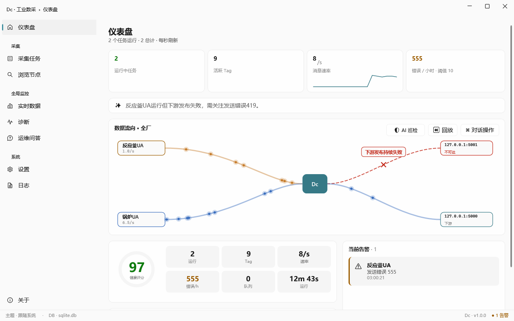

每个采集任务一条管道，数据点实时流动。下游断了立刻显示红色断口和「不可达」，还给出确定性外推——**「错误 +60/分，1 小时将新增 ≈3575 条失败」**，让你知道这事有多急。

---

## AI 巡检员：光球逐任务巡逻，扫到故障就插旗

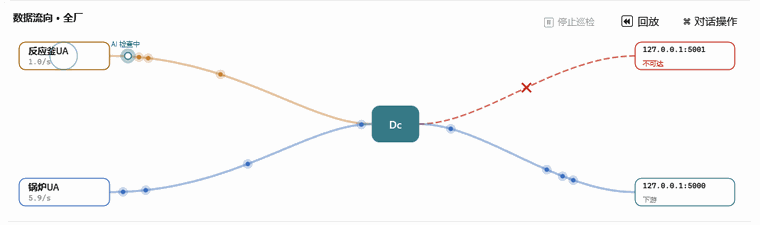

不用一直盯屏幕。巡检员扫过每个任务，把有问题的插旗标出来，扫完给一份人话报告：

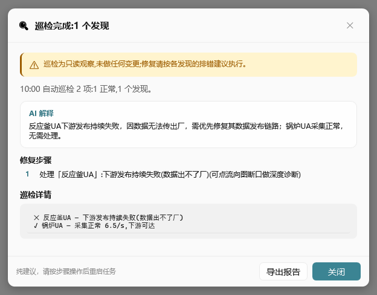

> 「反应釜UA 下游发布持续失败，因数据无法传出厂，需优先修复其数据发布链路；锅炉UA 采集正常，无需处理。」

**巡检只读观察，不做任何变更**——修复建议给你，动手与否你决定。

---

## 点一下断口，AI 帮你找根因

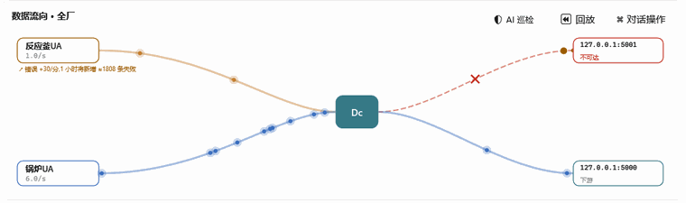

彗星沿管道逆流扫描，定位到断点后弹出诊断：根因解释 + 分步修复清单 + 运行期指标详情。**纯建议，不会自动改配置或重启任务。**

---

## 说人话问，答案落在真实数据上

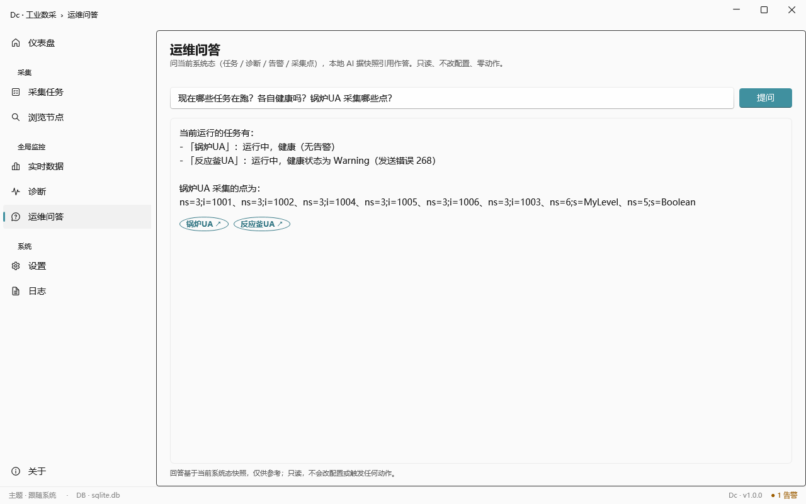

问「现在哪些任务在跑？各自健康吗？锅炉UA 采集哪些点？」——答案直接引用真实任务名、真实健康态、真实节点 ID。

问快照里没有的东西（比如「上周的吞吐趋势」），它会老实说**「快照中没有该信息」**，不编。

答案引用了哪个任务，流向图就高亮哪条管道、其余沉暗：

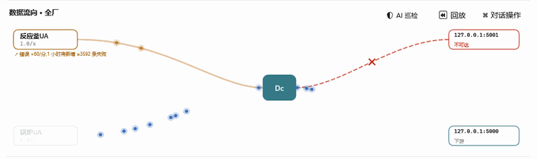

---

## 选点、建组，用自然语言

| 说「找出周期信号」→ AI 勾中 4 个波形 | 说「周期信号采集组, 1秒」→ AI 成组 |
|---|---|
| 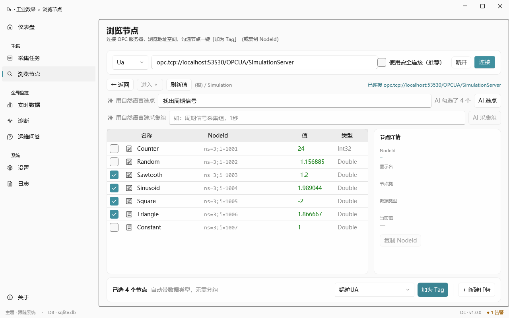 | 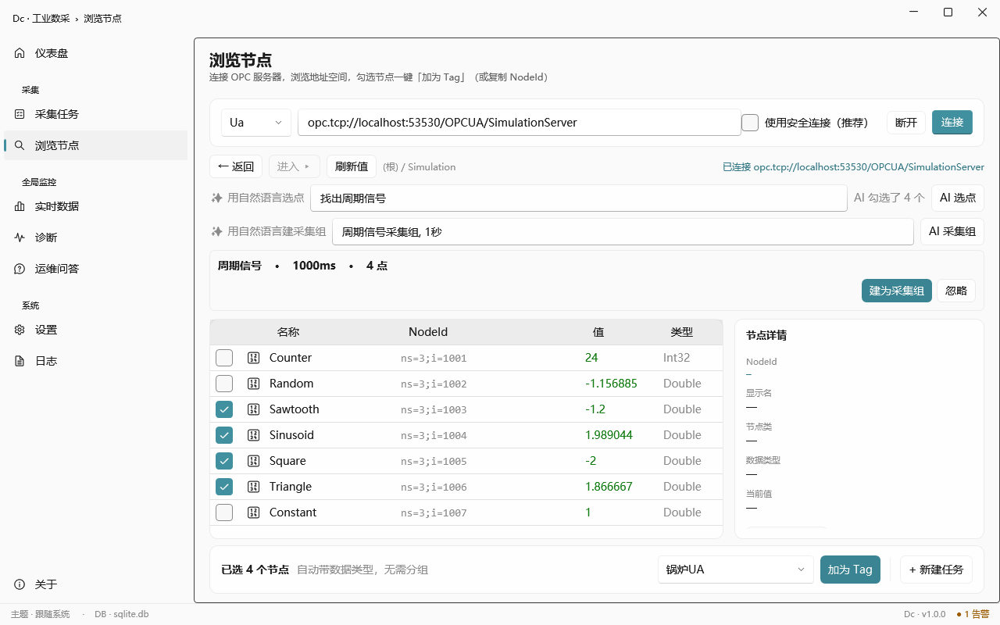 |

AI 只提建议并勾给你看，**采纳与否你点头**。

---

## 浏览地址空间 · 实时数据

| 浏览节点，勾选即加为 Tag | 实时数据，带趋势和质量码 |
|---|---|
| 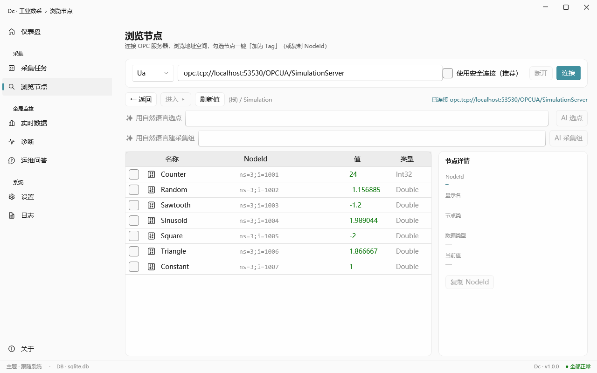 | 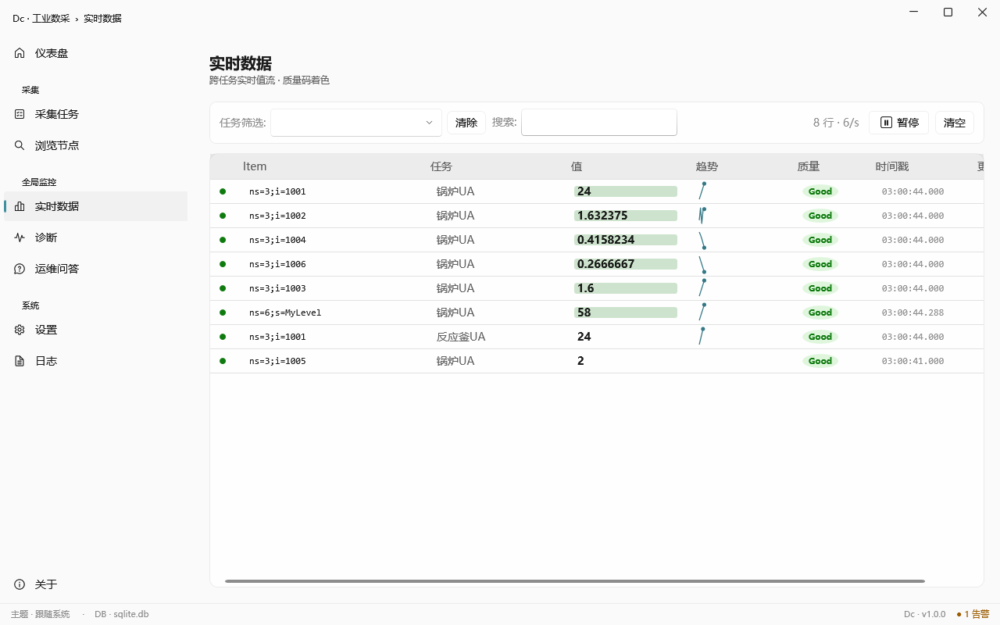 |

---

## AI 模型自己管，换模型不用改配置文件

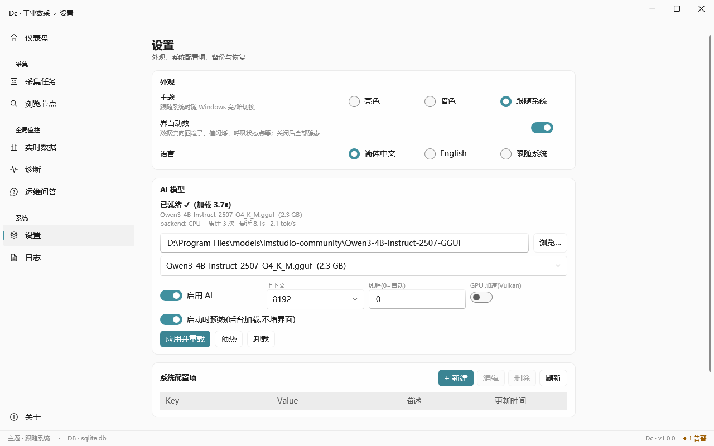

界面里选 GGUF 模型、热切换、开关 GPU（Vulkan）加速、看推理统计。模型跑在你自己机器上。

---

## 运行诊断

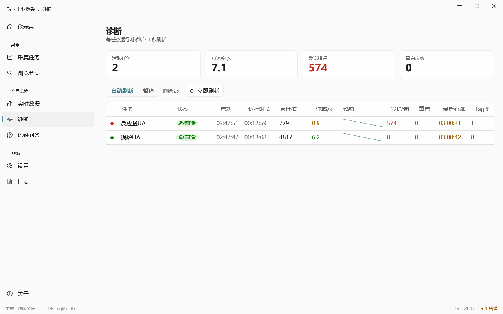

每任务的累计值、速率、趋势、发送错误、重启次数、心跳——一张表看完。

---

## 下载与许可

**[⬇ 前往 Releases 下载](../../releases/latest)**

- **非商用免费** —— 个人、评估、组织内部使用无需付费
- **商用部署需事先书面授权** —— 用于商业产品、对外服务或收费部署前请联系
- 禁止反编译、逆向工程；可原样转发未经修改的完整发行包

完整条款见发行包内 `LICENSE-FREEWARE.txt`。联系：**adamyxt@outlook.com**

---

## 关于本版本

免费版为 **Windows x64 桌面端**，含 **OPC UA / Modbus / Siemens S7 / IEC 60870-5-104** 采集 + 全套本地 AI 功能。

**不含的两项，理由不同，分开说明：**

- **OPC DA / AE** —— 依赖 GPL 许可的组件，不在闭源发行范围内。需要请联系授权。
- **EtherNet/IP**（罗克韦尔 / AB Logix）—— **不是许可问题**（其依赖是 Apache-2.0），而是它**尚未在真实 Allen-Bradley 硬件上验证过**，只跑过软 PLC 仿真。没验过的东西不放进发行包。

### v1.1.0 更新（IEC 60870-5-104）

IEC104 之前被排除是**许可原因**：底层库是 GPL 的。现已换成 MIT 许可的实现，这个原因不复存在，故纳入免费版。

换库不是换了就发，先做了验证：

- **两个独立实现互操作** —— 新客户端与另一套独立的 CS104 服务端对接，五类信息对象（短浮点 / 标度值 / 归一化 / 单点 / 双点）的值与质量位全部正确
- **600 秒连续浸泡** —— 299 轮总召唤、2100 个 ASDU，连接全程保持激活（流控状态机不会跑一阵就掉线）

用法：新建任务选协议 IEC104，连接串 `iec104://主机:2404?ca=1`，测点填 `ioa:1001` 形式。

截图均为真机运行实拍（OPC UA 仿真服务器 + 本地 4B 量级模型）。软件按「原样」提供，不附带任何明示或默示担保。
