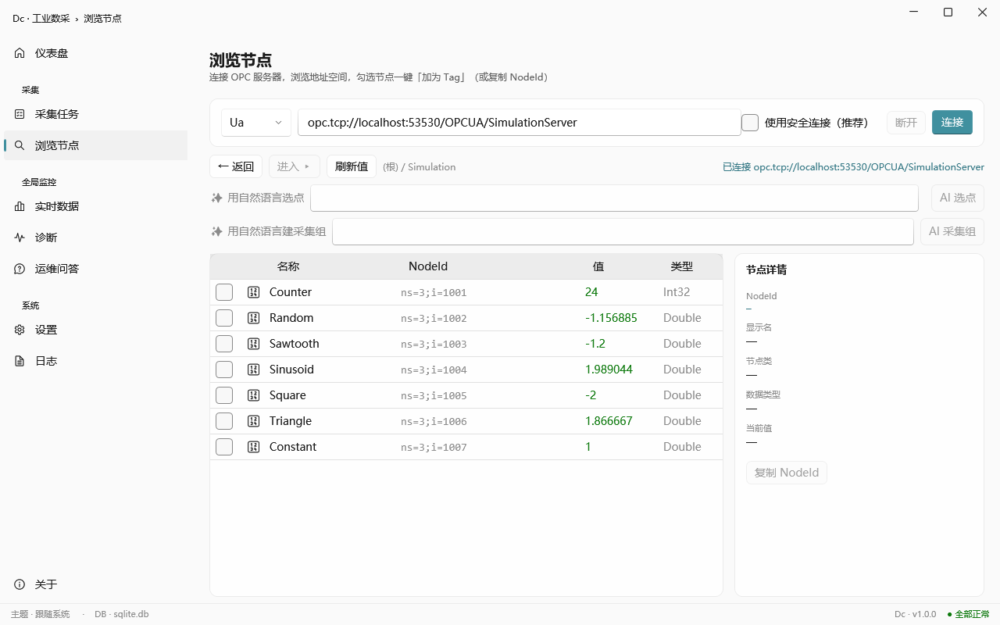
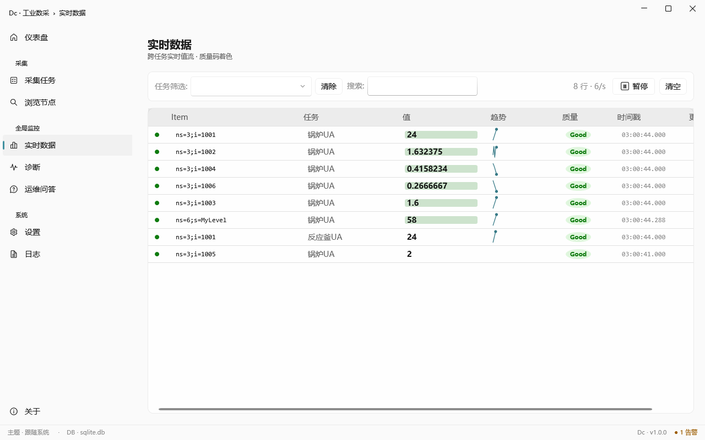
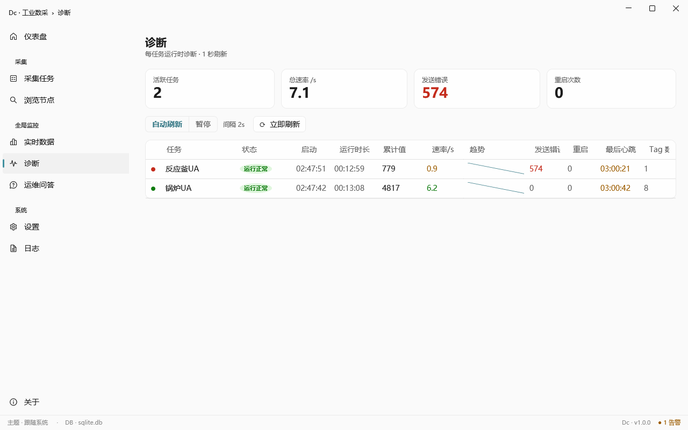

# Dc · 工业数据采集（免费版 Freeware）

中文 · **[English](README.en.md)**

> 通用工业数据采集客户端，内置**本地 AI 副驾**。免费下载使用，闭源二进制发行。

采集 **OPC UA / OPC DA / Modbus / Siemens S7 / IEC 60870-5-104** 设备数据，实时订阅后经 TCP 发布到下游系统。全套 AI 能力**在本地跑**——不联网、不上云、数据不出厂。

**[⬇ 下载最新版 v1.3.0](../../releases/latest)** · Windows x64 桌面端 · 约 100 MB · 解压双击 `Dc.App.exe` 即用（自带 .NET 运行时，**无需安装 .NET**）

> **v1.3.0 是一次稳定性版本**：修好了「装到 `Program Files` 后打不开」，并让升级不用手工搬数据。首次运行 Windows SmartScreen 会提示「未知发布者」——发行包未做代码签名，点「更多信息 → 仍要运行」。

---

## 数据流向，一眼看清全厂

每个采集任务一条管道，数据点实时流动。下游断了立刻显示红色断口和「不可达」，还给出确定性外推——**「错误 +60/分，1 小时将新增 ≈3575 条失败」**，让你知道这事有多急。

---

## AI 巡检员：光球逐任务巡逻，扫到故障就插旗

不用一直盯屏幕。巡检员扫过每个任务，把有问题的插旗标出来，扫完给一份人话报告：

> 「反应釜UA 下游发布持续失败，因数据无法传出厂，需优先修复其数据发布链路；锅炉UA 采集正常，无需处理。」

**巡检只读观察，不做任何变更**——修复建议给你，动手与否你决定。

---

## 点一下断口，AI 帮你找根因

彗星沿管道逆流扫描，定位到断点后弹出诊断：根因解释 + 分步修复清单 + 运行期指标详情。**纯建议，不会自动改配置或重启任务。**

---

## 说人话问，答案落在真实数据上

问「现在哪些任务在跑？各自健康吗？锅炉UA 采集哪些点？」——答案直接引用真实任务名、真实健康态、真实节点 ID。

问快照里没有的东西（比如「上周的吞吐趋势」），它会老实说**「快照中没有该信息」**，不编。

答案引用了哪个任务，流向图就高亮哪条管道、其余沉暗：

---

## 选点、建组，用自然语言

| 说「找出周期信号」→ AI 勾中 4 个波形 | 说「周期信号采集组, 1秒」→ AI 成组 |
|---|---|
|  |  |

AI 只提建议并勾给你看，**采纳与否你点头**。

---

## 浏览地址空间 · 实时数据

| 浏览节点，勾选即加为 Tag | 实时数据，带趋势和质量码 |
|---|---|
|  |  |

---

## AI 模型自己管，换模型不用改配置文件

界面里选 GGUF 模型、热切换、开关 GPU（Vulkan）加速、看推理统计。模型跑在你自己机器上。

---

## 运行诊断

每任务的累计值、速率、趋势、发送错误、重启次数、心跳——一张表看完。

---

## 下载与许可

**[⬇ 前往 Releases 下载](../../releases/latest)**

- **非商用免费** —— 个人、评估、组织内部使用无需付费
- **商用部署需事先书面授权** —— 用于商业产品、对外服务或收费部署前请联系
- 禁止反编译、逆向工程；可原样转发未经修改的完整发行包

完整条款见发行包内 `LICENSE-FREEWARE.txt`。联系：**adamyxt@outlook.com**

---

## 关于本版本

免费版为 **Windows x64 桌面端**，含 **OPC UA / OPC DA / Modbus / Siemens S7 / IEC 60870-5-104** 采集 + 全套本地 AI 功能。

**不含的两项，理由都已不是许可**（自 v1.2.0 起，软件全部依赖均为宽松许可，无 GPL 组件）：

- **OPC AE** —— 其 COM 客户端为本项目**自行编写**、无 GPL 依赖；只是首次真机验证时间尚短，先在商用版稳定跑一段时间再放进免费版。
- **EtherNet/IP**（罗克韦尔 / AB Logix）—— 其依赖是 Apache-2.0，同样**不是许可问题**，而是它**尚未在真实 Allen-Bradley 硬件上验证过**，只跑过软 PLC 仿真。没验过的东西不放进发行包。

### v1.3.0 更新（装哪都能跑 + 升级零手工 + 四个稳定性修复）

**装到 `Program Files` 后打不开，已修。** 此前程序把数据库和日志写在自己的安装目录，而普通用户对
`Program Files` 只有读权限——于是程序启动即退出，**连日志都没有**（只解压到普通文件夹使用的人碰不到这个问题）。
现在数据统一放在 `%LOCALAPPDATA%\Dc`（任务库、日志、证书、界面偏好、离线队列），安装到哪个目录都能跑。

**升级不用手工搬数据。** 首次启动会自己找到旧版本的数据并复制过来——包括任务、标签、界面偏好和 OPC UA 证书；
旧数据保留不删，导入成功会提示一次。从旧目录搜到的受信证书，复制前会先问你一次再拷（证书决定连谁、信谁，不替你默认）。

**四个稳定性修复：**

- **多台设备同时连接时不再误报连接超时** —— Modbus 与 S7 的连接和读写此前会占住线程池，同时连一批设备时互相排队，
  明明设备正常却报超时。现改为真正的异步，不再互相拖累。
- **下游断开后整条发送不再卡死** —— 此前连接下游没有超时上限，一旦对方地址不可达（防火墙丢包最明显），
  整条发送链被一把锁卡停，待发数据无上限地堆积，而错误计数和「下游不可达」指示**一动不动**，看起来一切正常。
- **离线队列不再静默丢数据** —— 断网期间缓存的数据，在一种清理失败的情况下会被永久跳过不补发，
  而界面上待发字节数显示为 0、指标全绿，**看不出丢了**。现改为宁可重发也绝不静默跳过。
- **安装包修好并验过** —— 安装程序此前从未成功编译过；现已修好，且实际走了一遍安装与卸载。

**免费版打开全功能版的任务时不再改协议。** 若任务用的是免费版不含的 OPC AE 或 EtherNet/IP，
现在保留原协议并说明原因，不会悄悄改成别的协议。

---

### v1.2.0 更新（纳入 OPC DA + 安全修复）

**OPC DA 纳入免费版。** DA 之前排除是**许可原因**（底层客户端库是 GPL 的）。现已换成 MIT 许可的实现，
并在真实 OPC DA 服务器上完成端到端验证（订阅收值 / 服务器枚举 / 地址空间浏览 / CLSID 直连 / 断线重连），
故纳入免费版。老厂遍地是 DA 服务器，这条对现场接入很实用。

用法：新建任务选协议 DA，节点填主机/IP（本机 `localhost`），ProgID 填服务器的 ProgID（如 `Matrikon.OPC.Simulation.1`）。

**同时携两项安全修复**（无论用哪个协议都建议升级）：

- **Modbus 整数写不再静默截断** —— 此前向整数寄存器写一个带小数的值（如误填 3.7）会被静默截成 3 写进设备、还报「成功」。现改为直接拒绝并报错，避免把错误设定值写进 PLC 而不自知。
- **配置「替换」式恢复失败不再抹库** —— 此前若在设置页用「替换」模式导入一份损坏的备份，可能把现有任务/标签/配置全部清空且不可恢复。现改为整体事务，失败自动回滚，原配置保住。

---

### v1.1.0 更新（IEC 60870-5-104）

IEC104 之前被排除是**许可原因**：底层库是 GPL 的。现已换成 MIT 许可的实现，这个原因不复存在，故纳入免费版。

换库不是换了就发，先做了验证：

- **两个独立实现互操作** —— 新客户端与另一套独立的 CS104 服务端对接，五类信息对象（短浮点 / 标度值 / 归一化 / 单点 / 双点）的值与质量位全部正确
- **600 秒连续浸泡** —— 299 轮总召唤、2100 个 ASDU，连接全程保持激活（流控状态机不会跑一阵就掉线）

用法：新建任务选协议 IEC104，连接串 `iec104://主机:2404?ca=1`，测点填 `ioa:1001` 形式。

截图均为真机运行实拍（OPC UA 仿真服务器 + 本地 4B 量级模型）。软件按「原样」提供，不附带任何明示或默示担保。
